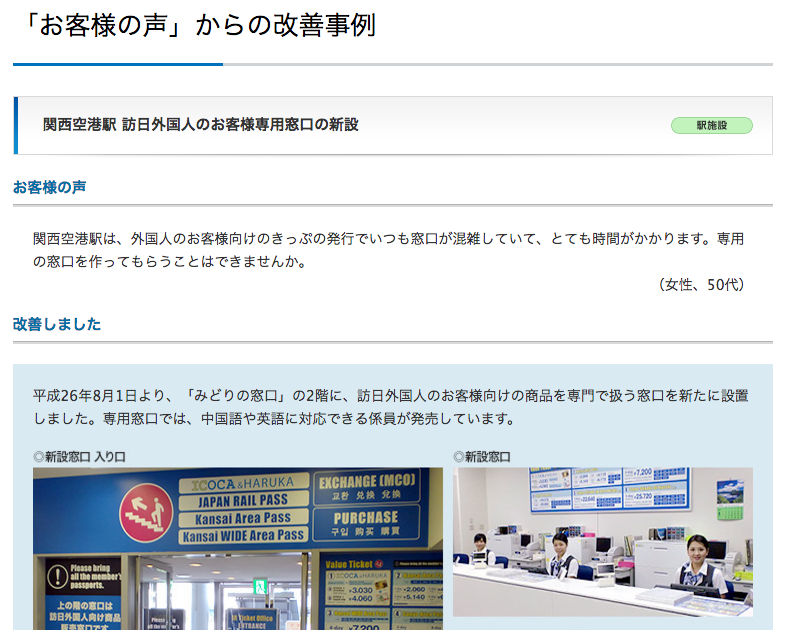

name: inverse
layout: true
class: center, middle, inverse

---

# 新幹線チケットのオンライン
# 代理購入サービス
# Exticket.jp

PayPal Tech Meetup #3  
山内 雅浩  
@algas

---

layout: false

# Agenda

1. 背景 (Background)
2. サービス紹介 (Service Introduction)
3. デモ (Demo)
4. 将来の展望 (Vision for the future)

---

## サービスを作った背景

引用:JR西日本のサイトより (https://www.westjr.co.jp/company/action/service/voice/2014/0801.html)

---

### 「訪日外国人が増えたので外国人専用の有人窓口を作りました！」

--
## .red-text[いや、そうじゃないだろ！]

--
### 真の「おもてなし」とは、

--
### 券売機を分かりやすくしたりオンラインで買えること

--
## オンラインで切符を購入できたら便利で安心ですよね？

---

## Exticket.jp を作った３つの理由  
--

1. 見知らぬ国の現地で切符を買う不安を解消したい  
どうやって切符を買えばいいのか、言葉が通じるのか、カードは使えるのか。
--

2. 訪日外国人がオンラインで新幹線切符を買えない  
JR各社のサービスに登録しなければオンラインでは切符を買えません。
--

3. フリーパスだけでは指定席に乗れない  
Japan Rail Pass の所有者は窓口で席を予約しなければ指定席に乗れません。
外国語対応の券売機があるにも関わらずJR窓口は外国人で長蛇の列ができる。

---

## サービス紹介

オンラインで新幹線切符を購入して郵送で受け取れるサービス  
※サービス手数料と送料はお客様の負担となります。

--
1. ユーザは Exticket.jp で新幹線切符を予約します。  
料金の支払いはもちろん PayPal で。

--
2. 運営が切符を発券して郵送します。  
ユーザは日本の宿泊先で切符を受け取ります。

--
3. 新幹線乗車当日は窓口に並ばず新幹線に乗れます。  
快適な旅行体験はプライスレス！

---

## デモ

http://demo.exticket.jp

### 開発環境

- 自然言語: English (今後、他言語にも対応する予定)
- プログラミング言語: Python
- フレームワーク: Toranado
- データベース: MySQL
- API: Express Checkout

---

## 将来の展望

- リリース予定: 2016年中
- 宣伝: 多くの人に利用してもらいたい
- 多言語対応: 中国語、韓国語などへの対応
- サービス拡張: JR北海道・九州、各社特急への対応
- 他サービスとの連携: 旅行サイト、ホテル予約サイト、航空券予約サイトなど

--

### 最終目標: 大手旅行サイト運営企業に買収され安定したサービスを提供すること

---

## 自己紹介

山内 雅浩  
.blue-text[@algas] (github, qiita, twitter)  

本サービスへの出資や業務提携を検討されている皆様、  
この後の懇親会でぜひお話させてください！

## Exticket.jp をよろしくお願いします！
